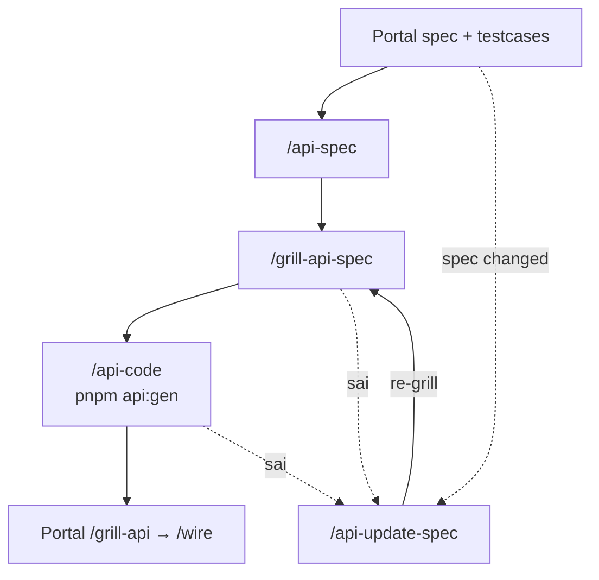

# API Docs

Backend documentation — mirror Portal layout: YAML source of truth + markdown generated cho review.

```bash
pnpm install          # repo root
pnpm docs:render      # YAML → generated/*.md
pnpm docs:dev         # VitePress preview
```

**Preview local:** [http://localhost:5173](http://localhost:5173) sau `pnpm docs:dev`

## Team workflow



[Full diagram + checklist → Team AI Backend Workflow](./operational/TEAM-AI-BACKEND-WORKFLOW.md)

## Operational

| Doc | Mô tả |
|-----|--------|
| [Team AI Backend Workflow](./operational/TEAM-AI-BACKEND-WORKFLOW.md) | Diagram đầy đủ, commands, extracts |
| [Unit phase diagram (PHPUnit)](./operational/UNIT-PHASE-DIAGRAM.md) | `/unit` → `/grill-unit` + `#needs-unit-test` lifecycle |
| [Backend API Spec Guide](./operational/BACKEND_API_SPEC_GUIDE.md) | Cách viết `01-backend-spec.yaml` |
| [Integration / Webhook](./operational/INTEGRATION-API-SPEC.md) | Không Portal FE — partner & webhook |

Portal FE workflow: `../portal/docs/operational/TEAM-AI-WORKFLOW.md`

## API Base & contracts

| Doc | Mô tả |
|-----|--------|
| [API Base overview](./api-base/index.md) | Conventions, generators |
| [Generated feature contracts](./api-base/generated.md) | Index `features/**/generated/` |
| [Integration spec (common)](./features/common/generated/common-integration-spec) | Alias `/api-int-spec` · `/grill-int-spec` |
| [Conventions](./api-base/CONVENTIONS.md) | Layer, module-first |
| [Generators](./api-base/GENERATORS.md) | `m:*`, `add:*`, tests |

## OpenAPI & Swagger

| Doc | Mô tả |
|-----|--------|
| [OpenAPI hub](./openapi/index.md) | `api.yaml`, lint, preview |
| Swagger UI | `/swagger/` khi chạy `pnpm docs:dev` |

## Onboarding

- [Backend Phase 3b Slides](./onboarding/team-backend-phase3b-slides.md)

## Scripts (repo root)

| Command | Mô tả |
|---------|--------|
| `pnpm docs:render` | Render backend-spec markdown |
| `pnpm openapi:render` | Merge feature OpenAPI → `api.yaml` |
| `pnpm api:gen:dry` | Codegen plan + gates |
| `pnpm api:gen` | Execute artisan (sau approval) |

Chi tiết: `scripts/docs/README.md` · `codegen/runners/README.md`
